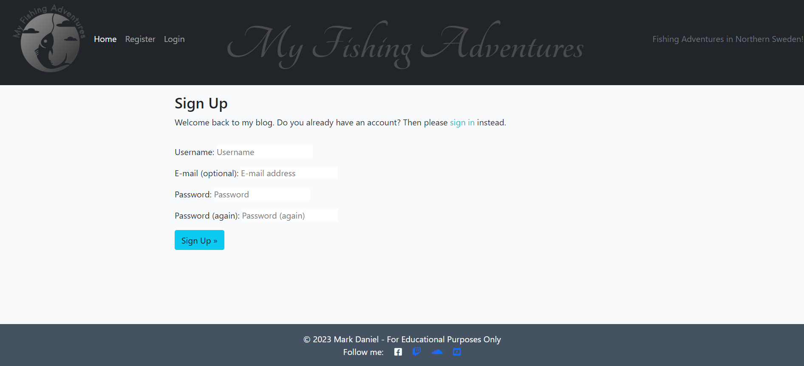
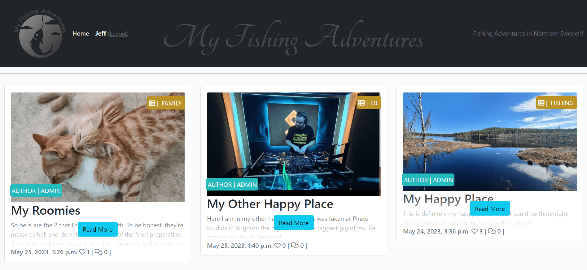
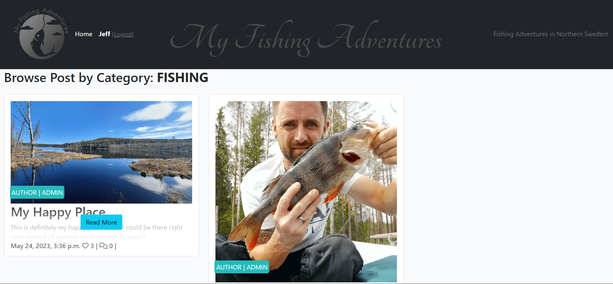
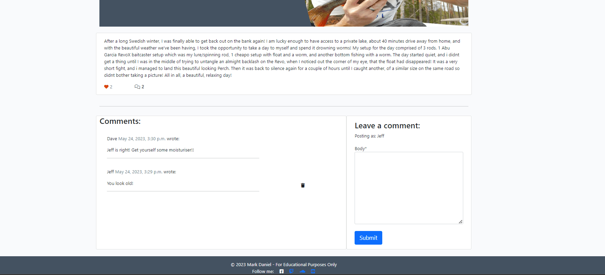
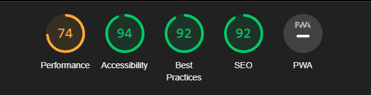
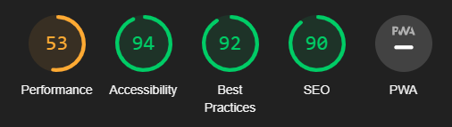
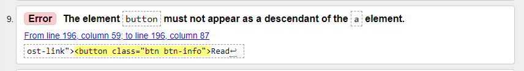
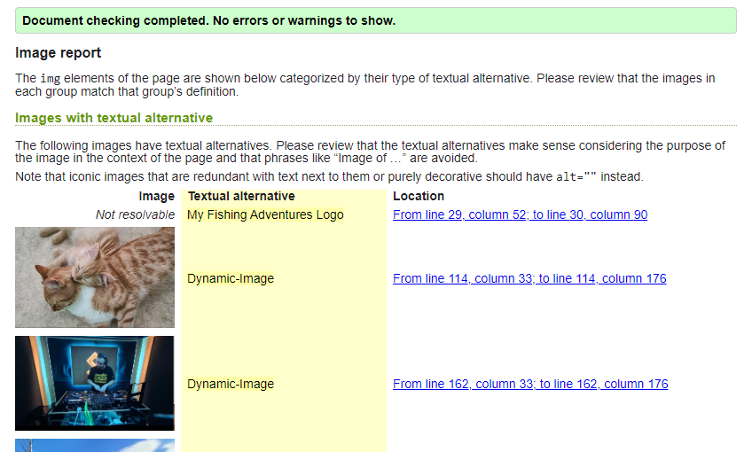

# My Fishing Adventures

### My Adventures in Northern Sweden


Portfolio 4 project as part of the Diploma in Full Stack Software Development by Code Institute.
___

My Fishing Adventures is a blog, mainly to record and share my fishing trips, but also share other types/categories of content and allow users to interact with myself and others.

It is a fullstack blog site that allows users to read blog posts, create an account and comment on the posts.

Link to live site - [https://md82p4blog.herokuapp.com/](https://md82p4blog.herokuapp.com/)

## CONTENTS

- [My Fishing Adventures](#my-fishing-adventures)
  - [My Adventures in Northern Sweden](#my-adventures-in-northern-sweden)
  - [CONTENTS](#contents)
  - [Site Objectives](#site-objectives)
- [User Experience/UX](#user-experienceux)
  - [Target Audience](#target-audience)
  - [User Stories](#user-stories)
    - [New Visitor Goals](#new-visitor-goals)
    - [Existing Visitor Goals](#existing-visitor-goals)
- [Design Choices](#design-choices)
  - [Colour Scheme](#colour-scheme)
  - [Typography](#typography)
  - [Logo and Favicon](#logo-and-favicon)
- [Features](#features)
  - [Registration](#registration)
- [Future Features](#future-features)
- [Technologies Used](#technologies-used)
- [Programming Languages, Frameworks and Libraries Used](#programming-languages-frameworks-and-libraries-used)
- [Agile](#agile)
- [Testing](#testing)
  - [Testing](#testing-1)
    - [User](#user)
  - [Bugs](#bugs)
  - [Validation Testing](#validation-testing)
    - [HTML \& CSS](#html--css)
  - [Credits](#credits)
    - [Media](#media)
    - [Acknowledgments](#acknowledgments)

___

## Site Objectives

Design and create a blog site to demonstrate an increasing understanding of the libraries and frameworks available to developers.

My three main objectives were:

- ### Create a readable, clean and responsive front end

  I wanted to make the site easily accessible and intuitively navigated for the users. Django and Bootstrap were used to create and style the front end.

- ### Make use of available backend functionality

  The use of the backend framework allows users to create a profile, comment on any of the blog posts on the site, as well as deleting their own comments should they wish to.

- ### Store data on an external cloud database

  I used ElephantSQL to store the PostgreSQL databse for this project.

___

# User Experience/UX

## Target Audience

- Users that are interested in fishing, northern Swedish landscapes and cats!

## User Stories

### New Visitor Goals

- To understand what the site and content is about.
- How to navigate the site.
- Create an account and engage with the site and other users and site owner.

### Existing Visitor Goals

- Log in and out of their account.
- Read blog posts and comments on each post.
- Add their own comments on blog posts on the site to engage with site owner and other users.

___

# Design Choices

## Colour Scheme

The colour scheme used for this project was based on the colors from Code Institute's 'I think therefore i blog' walkthrough module. I have added and modified many aspects of the styling and colours to suit my intentions. It is a fairly neutral scheme, with mostly only the actionable aspects (buttons/links etc) displayed in brighter colours for ease of navigation or site use.

## Typography

The main font used is Verdana, but Tangerine was used for the main logo text on the navbar

## Logo and Favicon

The logo was created using an online logo creator - [Brandcrowd](https://www.brandcrowd.com/)

# Features

## Registration

The user can create an account



View Blog Posts on Home Page



Browse by Post Category



Comment on Blog Posts.

*Also shown here is the trashcan which allows users to delete their own comments should they wish.*



# Future Features

- Add option for users to edit comments
- Add option for users to upload photos into the comments

___

# Technologies Used

Here are the technologies used to build this project:

- [Github](https://github.com) To host and store the data for the site.
- [CodeAnywhere](https://www.codeanywhere.com) the IDE where the site was built.
- [PEP8 Validator](https://pep8ci.herokuapp.com/) Used to check python code for errors
- [ElephandSQL](https://www.elephantsql.com/) Used to store PostgreSQL database.
- [Cloudinary](https://cloudinary.com/) Used as cloud storage for images uploaded as part of the blog posts
- [Heroku](https://id.heroku.com/login) Used to deploy the project

# Programming Languages, Frameworks and Libraries Used

- [HTML](https://developer.mozilla.org/en-US/docs/Web/HTML)
- [CSS](https://developer.mozilla.org/en-US/docs/Learn/Getting_started_with_the_web/CSS_basics)
- [Python](https://en.wikipedia.org/wiki/Python_(programming_language))
- [Django](https://www.djangoproject.com/)
- [Bootstrap](https://getbootstrap.com/)

# Agile

This project was designed using Agile methodology, utilising the Project Board and Issues sections in GitHub

- [Project Board](https://github.com/users/markdaniel1982/projects/4/views/1)

# Testing

As each section or function/Model was built during this project, I was testing for functionality and styling issues that may have arisen, which were corrected or fixed before continuing. I also had friends test the site by signing up, adding and deleting comments using various devices on varying platforms (IOS, Android, Mobile Tablet etc) and reporting back any issues they encountered with functionality or styling.

## Manual Testing

*For any Fails, there is a more detailed description below the table*

ADMIN
| TEST | OUTCOME | PASS/FAIL|
|:---:|:---:|:---:|
| Create Blog Post | Post successfully created and displayed | Pass |
| Edit Blog Post | Error thrown when editing post title & slug <sup>(1)</sup> | FAIL |
| Edit Blog Post (after fix) | Post content and category updated successfully | Pass |
| Delete User Comments | Comment deleted successfully | Pass |
| Delete Blog Post | Post deleted successfully | Pass |

<sup>(1)</sup> - While testing the ability to edit posts (Limited to Admin only), I had a problem when editing the title and slug of the post. This was due to the URL not being able to find the original slug of the post (because it had been changed during the edit) to route it after the editing was complete. At this stage, I felt the easiest fix was to remove the ability to edit the post title and slug in the browser, but this functionality is still available via the django admin panel.

## User

| TEST | OUTCOME | PASS/FAIL|
|:---:|:---:|:---:|
| Create Account | Created successfully | Pass |
| Login | Login Successful | Pass |
| Logout | Logout Successful | Pass |
| Read Full Blog Post | PostDetail page loaded successfully | Pass |
| Add Comment under Blogpost | Comment Added Successfully | Pass |
| Delete Comment | Comment Deleted | Pass |
| Filter Posts by category | Posts marked as desired category displayed successfully | Pass |

## Bugs

One of my users reported that they were unable to sign up when including an email address (although the inclusion of an email address is not required), but myself and others were unable to replicate this issue so the bug was marked as closed.

At different points throughout this project, I encountered various bugs involving the styling. These usually appeared after adding a new section or template page. These were all fixed using Bootstrap classes or custom CSS to override any issues caused by Bootstrap itself.

Towards the end of completion, I had an issue with the database, where I had made a change to the Post Model, but hadn't migrated the changes after undoing the changes in the code relating to that change. This required me to reset the database, which was done with help from Rebecca via the Code Institute's Tutor Support. The changes related to the Category Model and the choices available when creating an account.

To enable me to reset the database, I first had to comment out the code (related to "choices" in the model) to stop the code being run and causing an error. Once this was done, the database was reset, seemingly without issue.

Then I had a problem with the "Create a Post" page. When adding a new blog post via the browser, the images were not being sent to cloudinary for cloud storage, and the ElephantSQL cloud database was also not recieving any data. This was a very simple fix as I needed to add ```enctype="multipart/form-data"``` into the form element.

## Lighthouse

The performance scores appear to be low, and I believe this is due to the images uploaded for each blog post are hosted on a third-party cloud based platform.

Mobile



Desktop




## Validation Testing

### HTML & CSS

HTML & CSS testing was completed using [W3 Validator](https://validator.w3.org/)

When validating the code, I had the error shown below. this was fixed by removing the button, and using Bootstrap styles to display the link as a button instead



Fixed:



## Python Testing

Python pep8 validation was done via [Code Institute's Python Linter](https://pep8ci.herokuapp.com/)

The only errors recieved here were where some lines of text exceeded the limit of 79 characters, but this has no effect on the functionality of the project.

Python Files Tested:
models.py
forms.py
views.py
urls.py

___

## Credits

This project was based on the Code Institute's - I think therefore I blog walkthrough module which provided a standard blog 'base'. From this base I customised a lot of the layout and styling with Bootstrap and custom CSS. I also added a custom model for Category. This allowed me to create a functionality within the site for users to filter the blog posts by a selected category. I added several custom Views and Forms to the site, as well as ensuring that all links and desired functionality was working as intended with no errors.

For a lot of inspiration and fine-tuning of my code I referred to John Elder's youtube channel [Codemy](https://www.youtube.com/@Codemycom) where I was able to get a better understanding of how to correctly create this type of product using Django and Bootstrap

The Readme layout was inspired by [Kera Cudmore - Readme Examples](https://github.com/kera-cudmore/readme-examples/blob/main/README.md?plain=1)  and [Sdalsosa - Readme](https://github.com/Sdalsosa/ComposerHub/blob/main/README.md)

___

## Media

For placeholder images when no image is uploaded to blog post, I have used [picsum](https://picsum.photos/) which provides a library of stock images that display as a placeholder

All other content and images are my own

___

## Acknowledgments and Thanks

Sean & Oisin at Code Institute's tutor support for the help and guidance with my code related brain-melts.

Rebecca at Code Institute's tutor support for the database reset.

John Elder on the [Codemy](https://www.youtube.com/@Codemycom) youtube channel

Manual Testers:
- Liz Mayhew
- Tom Mayhew
- Nush
- Marie Daniel
- Hannah Cook
- Thomas Spåre
- Shubham Sinha